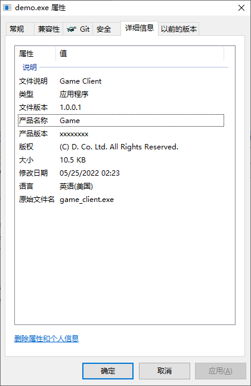

# Demo
Demo of Windows C++ application version information from resource file

# How to
1. Run command `build.cmd` to build & install demo to current directory
2. Right click `demo.exe`
3. Details tab will show as below

