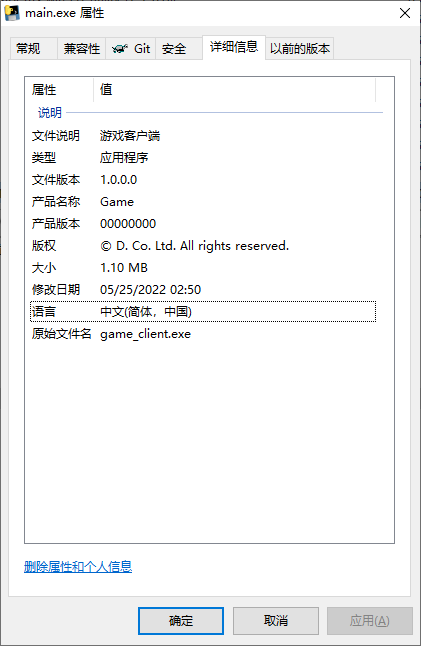

# Description
Demos for adding version to pyinstaller package

# Files
main.py     - source file
main.spec   - .spec file for pyinstaller
version     - version settings file

# How to
1. Build demo with `pyinstaller main.spec`
2. Right click `dist\main\main.exe`
3. Details tab will show as below



# Hint
In version file, we have following code
```
    kids = [
        StringFileInfo(
            [
                StringTable(
                    u'040904B0', # 040904B0 stand for string table 0
                    [ ... ]
                ),
                StringTable(
                    u'080404B0', # 080404B0 stand for string table 1
                    [ ... ]
                )
            ]
        ),
        VarFileInfo([VarStruct(u'Translation', [0x0804, 0x04B0])]) # translation is selected here
    ]
```

[0x0804, 0x04B0] combine into `0x080404B0`, same as string table 1, so main.exe carries info from string table 1